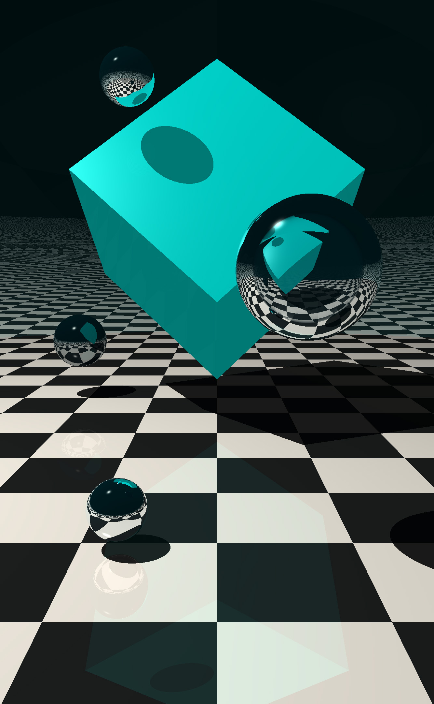

# LibRaytracer

A software-rendered 3D raytracing library, written from scratch in C++

## Overview

An accompanying desktop GUI is planned (GUI repo will be linked here when there's something
worth compiling to see). The drawing interface is currently procedural code.

> Multithreaded rendering, more optimization and generative textures are currently a work in 
> progress

See `demo/main.cpp` for an example of drawing some shapes with the current API.

> This started as a project based on the [Raytracer Challenge by Jamis Buck](http://raytracerchallenge.com/). One of the most fun books I've worked through in a long time!